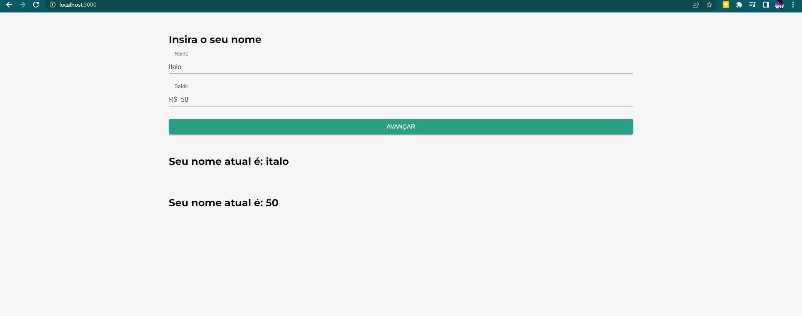
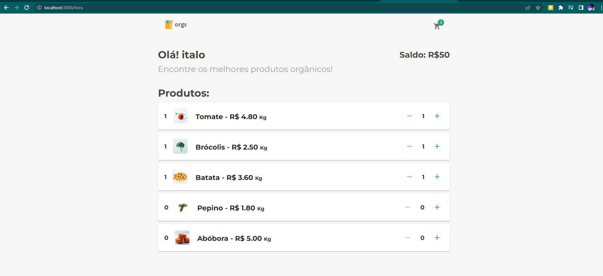

# Fotos do Projeto 

    Usuario
 

    Carrinho
 

    Pagamento
 

# versao
    "react": "^18.2.0",
    "react-dom": "^18.2.0",
    "react-router-dom": "^6.14.1",
    "react-scripts": "5.0.1",
    "styled-components": "^6.0.3",
# Sobre

utilizar o useMemo

Parâmetros prédefinidos

common/pagamento

    const tipoPagamento =[{
        nome:'Boleto',
        juros: 1,
        id: 1
    },{
        nome:"Cartao de Credito",
        juros: 1.5,
        id:2
    },{
        nome:"Pix",
        juros: 1.3,
        id:3
    }
    ];

Que é possível um contexto mudar outro contexto.

useEffect
# Provider
        <CarrinhoProvider>
            <Route path="/feira" element={
                <Feira/>

                } /> 
            <Route path={"/carrinho"} element={<Carrinho/>} />
        </CarrinhoProvider>
        ta me garantindo q carrinhoss pode pegar o context de CarrinhosProvider

>context é quando tem interação dinamica usuario e eventos (listar, salvar ,manter dados)

desacoplamento de responsabilidade

vantagens de manter a responsabilidade de mudar o contexto centralizado fora dos componentes.

Reaproveitamento de funções dentro do hook;

Utilizar hooks React para escutar mudanças no contexto e deixá-lo dinâmico;

3 contexto 
            
            - pagamento (forma de pagamento)
            -carrinho(quem foi seleciona e quantos tem)
            -usuario

Utilização de valores estáticos para popular o contexto.
# useEffect
        import { useMemo } from 'react';
            //parecido muda o valor quando os parametros mudar 
        const valorSobrando = useMemo(()=> numero - saltoDoCarrinho,[numero,saltoDoCarrinho])
        //so vai rederizar quando numero,saltoDoCarrinho mudar  ai vai fazer a conta

usado quando atualizar um estado interage com outro estado

            useEffect(()=>{},[estado])
# Reduce

        obj.reduce((contador,objitem) => contador + objitem.quantidade,0 )

# Hook customizados 

Pratica conhecida como -SOLID-

0 Componete fica com o minimo de responsabilizade 

queebrando o codigo e meelhorando sua organização e sua manutenção 

Entao Hook sao criado pra elevar funcoes que manipula aquele contexto.

Usar hooks customizados para externalizar a responsabilidade de mudar o contexto

Exportar funções para mudar o contexto
# ContextAPI

pouco performatico

        const somaDeAComB = a + b;

Mas imagina se existir cálculos gigantes e pesados que necessitam ser executados com a mudanças dessas variáveis? 

Com  uso de useMemo muito perfomatico

=====================================

 parâmetro pré definido        

        const { saldo = 0 } = useContext(UsuarioContext)C

=====================================

        ?.
        pergunta se objeto? esiite se sim . continua pra propriedade pra dentro do obj 

 so posso usar tando o hook customizado e hook useContext

 se eu tiver dentro do contexto children  nele que todo o context vai funcionar

so posso chamar dentro de children do context

crinado um novo hook com info de cont passado e funcao que usa esse context

            export const useCarrinhoContext =() => {
                const {carrinho,setCarrinho} = useContext(CarrinhoContext)
            
                // tentar criar 
                const somar = (novoProduto) => {}

              os context que retorna
            return({
                carrinho,
                setCarrinho,
                somar,
                quantidade
                })
            }

 Como evitar Props drilling
 
 criar pasta chamada src-common -Ususrio.jsx (de comum estados comum)

 modo antigo

    import { createContext } from ‘react’;

    export const UsuarioContext = createContext();
 
 =========

        import { UsuarioContext } from ‘common/context/Usuario’;
          <route>
          <UsuarioContext.Provider value={{ nome, setNome, saldo, setSaldo }} >
            <Login  />
          </UsuarioContext.Provider/>
          </route>

 == 
        
        import { UsuarioContext } from ‘common/context/Usuario’;
        <UsuarioContext.Consumer>
            {({nome, setNome, saldo, setSaldo}) => (
            <>
            ...
            </>
            )}
        </UsuarioContext.Consumer>

hook 16.8

    function MeuComponente() {
    const variavel1 = useContext(ContextoUm);
    const variavel2 = useContext(ContextoDois);
    const variavel3 = useContext(ContextoTres);
    return (
        <>
        ...
        </>
    )
    }

    componete
    UsuarioContext.Consumer>
	({v})=>{()}

====<h3>solid responsabilidade de estado </h3>

/commom/context/Componente

    export const UsuarioProvider = ({children})=>{
        const [nome, setNome] = useState("");
        const [numero, setNumero] = useState("");
        return(
            <UsuarioContext.Provider value={{nome,setNome,numero,setNumero}}>
                    {children}
            </UsuarioContext.Provider>
        )
    }

routes.jsx
    
                    <Route exact path="/" element={
                        <UsuarioProvider>
                            <Login />
                        </UsuarioProvider>
                    }/>

para mais de um 

                <UsuarioProvider>
                        <Route exact path="/" element={
                                <Login />
                        }/>

                        <Route path="/feira" element={
                        <Feira/>
                        } /> 
                    </UsuarioProvider>

Para receber o context

        const  {nome, setNome, numero, setNumero} = useContext(UsuarioContext);

# OBJ

Utilizar o ContextAPI para criar contextos fora dos nossos componentes;

Consumir o nosso contexto com Context.Consumer e com useContext;

A utilizar a extensão React Context Devtool;

Que não precisamos colocar o Context.Provider no root da aplicação, apenas onde usaremos;

A criar um componente já com o Provider dentro dele.

# Dependecia
    npm install --save styled-components
    npm install @mui/material @emotion/react @emotion/styled

    UsuarioContext.displayName="Usuario";

# lagado  
    const history = useHistory()
    history.push('/')

# Getting Started with Create React App

This project was bootstrapped with [Create React App](https://github.com/facebook/create-react-app).

## Available Scripts

In the project directory, you can run:

### `npm start`

Runs the app in the development mode.\
Open [http://localhost:3000](http://localhost:3000) to view it in your browser.

The page will reload when you make changes.\
You may also see any lint errors in the console.

### `npm test`

Launches the test runner in the interactive watch mode.\
See the section about [running tests](https://facebook.github.io/create-react-app/docs/running-tests) for more information.

### `npm run build`

Builds the app for production to the `build` folder.\
It correctly bundles React in production mode and optimizes the build for the best performance.

The build is minified and the filenames include the hashes.\
Your app is ready to be deployed!

See the section about [deployment](https://facebook.github.io/create-react-app/docs/deployment) for more information.

### `npm run eject`

**Note: this is a one-way operation. Once you `eject`, you can't go back!**

If you aren't satisfied with the build tool and configuration choices, you can `eject` at any time. This command will remove the single build dependency from your project.

Instead, it will copy all the configuration files and the transitive dependencies (webpack, Babel, ESLint, etc) right into your project so you have full control over them. All of the commands except `eject` will still work, but they will point to the copied scripts so you can tweak them. At this point you're on your own.

You don't have to ever use `eject`. The curated feature set is suitable for small and middle deployments, and you shouldn't feel obligated to use this feature. However we understand that this tool wouldn't be useful if you couldn't customize it when you are ready for it.

## Learn More

You can learn more in the [Create React App documentation](https://facebook.github.io/create-react-app/docs/getting-started).

To learn React, check out the [React documentation](https://reactjs.org/).

### Code Splitting

This section has moved here: [https://facebook.github.io/create-react-app/docs/code-splitting](https://facebook.github.io/create-react-app/docs/code-splitting)

### Analyzing the Bundle Size

This section has moved here: [https://facebook.github.io/create-react-app/docs/analyzing-the-bundle-size](https://facebook.github.io/create-react-app/docs/analyzing-the-bundle-size)

### Making a Progressive Web App

This section has moved here: [https://facebook.github.io/create-react-app/docs/making-a-progressive-web-app](https://facebook.github.io/create-react-app/docs/making-a-progressive-web-app)

### Advanced Configuration

This section has moved here: [https://facebook.github.io/create-react-app/docs/advanced-configuration](https://facebook.github.io/create-react-app/docs/advanced-configuration)

### Deployment

This section has moved here: [https://facebook.github.io/create-react-app/docs/deployment](https://facebook.github.io/create-react-app/docs/deployment)

### `npm run build` fails to minify

This section has moved here: [https://facebook.github.io/create-react-app/docs/troubleshooting#npm-run-build-fails-to-minify](https://facebook.github.io/create-react-app/docs/troubleshooting#npm-run-build-fails-to-minify)
